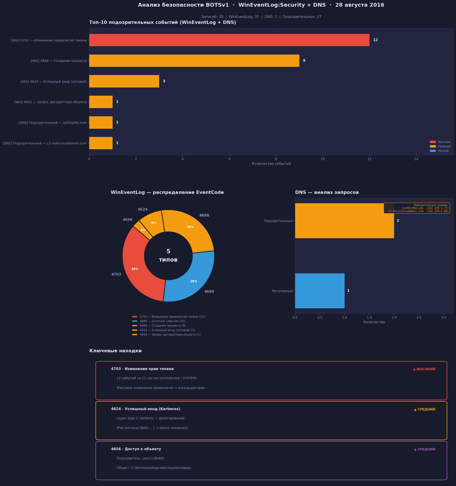

# Анализ логов BOTSv1 — WinEventLog:Security + DNS

Лабораторная работа по курсу Python · НИУ ВШЭ

---

## Задание

Проанализировать два типа логов из датасета BOTSv1, найти подозрительные
события и визуализировать 10 наиболее распространённых подозрительных событий.

---

## Структура

```
log-analysis/
├── botsv1.json          # Датасет (35 WinEventLog + 3 DNS = 38 записей)
├── log_analysis.py      # Скрипт анализа
├── botsv1_analysis.png  # Дашборд (создаётся при запуске)
└── README.md
```

---

## Этап 1. Загрузка и подготовка данных

Скрипт читает `botsv1.json` и разделяет записи на два датафрейма:
**WinEventLog** (35 записей) и **DNS** (3 записи).

Нормализация:
- Поля-списки (`Account_Name`, `Logon_ID`) → последний элемент (целевая учётка)
- Полный путь процесса → короткое имя (`C:\...\splunk-admon.exe` → `splunk-admon.exe`)
- `New_Process_Name` используется для EventCode 4688, `Process_Name` — для остальных

| Параметр | Значение |
|---|---|
| Источник | [BOTS v1](https://github.com/splunk/botsv1) |
| Дата | 28 августа 2016 г. |
| Всего записей | 38 |
| Хостов | 33 (`*.waynecorpinc.local`) |
| Уникальных EventCode | 5 |

---

## Этап 2. Анализ данных

### WinEventLog — подозрительные события по EventID

| EventCode | Описание | Риск | Кол-во | Почему подозрительно |
|---|---|---|---|---|
| 4703 | Изменение привилегий токена | 🔴 Высокий | 12 | Массовое изменение прав на 11 хостах — эскалация привилегий |
| 4688 | Создание процесса | 🟡 Средний | 9 | Среди процессов — `splunk-powershell.exe` (нетипичный) |
| 4624 | Успешный вход (сетевой) | 🟡 Средний | 3 | Kerberos + делегирование с IPv6 link-local — lateral movement |
| 4656 | Запрос дескриптора объекта | 🟡 Средний | 1 | `Lara.Culbreth` запросила доступ к системному каталогу |
| 4689 | Завершение процесса | 🔵 Штатное | 10 | Не является подозрительным |

Итого подозрительных: **25 из 35** событий WinEventLog.

### DNS — вредоносные и подозрительные запросы

Классификация по `eventtype` и паттернам в имени домена:

| Домен | IP-клиент | Категория | Причина |
|---|---|---|---|
| `ajd92jd9d.com` | 192.168.1.77 | Подозрительный | Помечен как suspicious в eventtype |
| `c2.maliciousdomain.com` | 192.168.1.88 | Подозрительный | Помечен как suspicious, имя содержит `c2`/`malicious` |

---

## Этап 3. Визуализация

Дашборд `botsv1_analysis.png` содержит:

1. **Топ-10 подозрительных событий** — объединённый барчарт WinEventLog + DNS,
   цвет = уровень риска
2. **Donut-диаграмма** — распределение всех EventCode в WinEventLog
3. **DNS-анализ** — барчарт категорий с выносом подозрительных доменов
4. **Ключевые находки** — карточки с разбором трёх наиболее подозрительных событий

---

## Запуск

```bash
pip install pandas matplotlib seaborn
python log_analysis.py
```

Скрипт ищет `botsv1.json` рядом с собой. Дашборд сохраняется как `botsv1_analysis.png`.

---

## Результат

