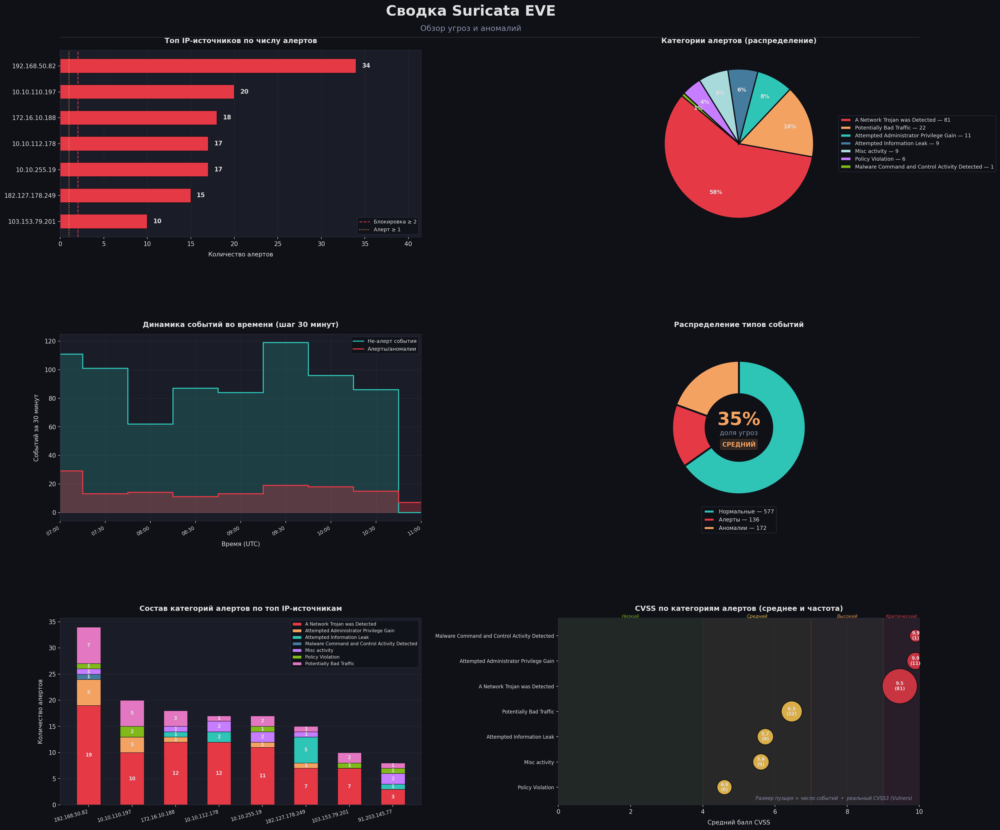
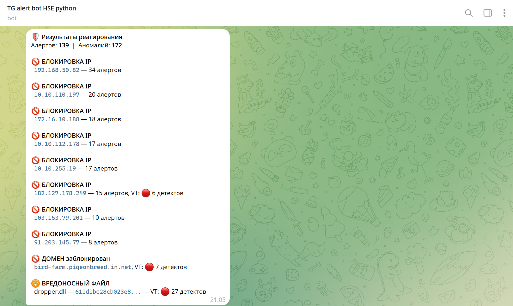
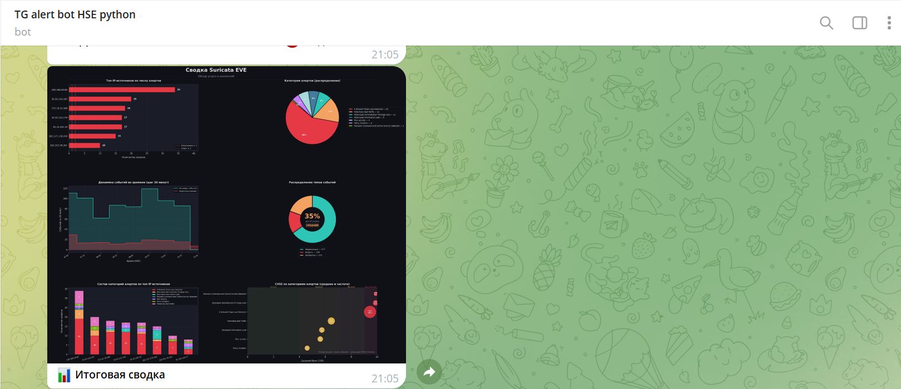
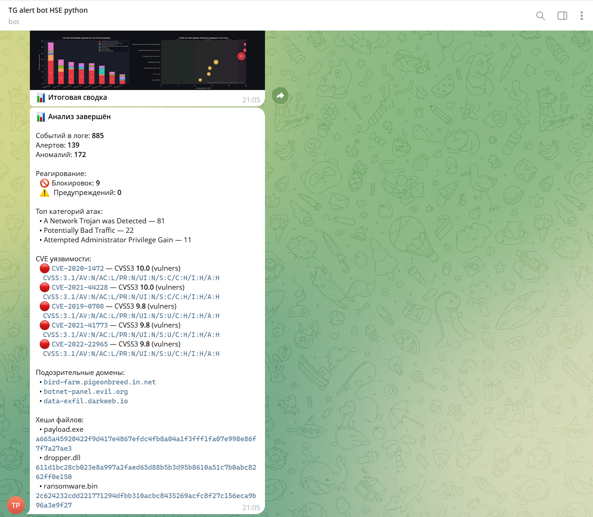

# Автоматизированный мониторинг и реагирование на угрозы

Система анализа сетевых событий на основе Suricata EVE JSON логов.
Извлекает подозрительные индикаторы компрометации (IoC), обогащает их данными из внешних API и формирует отчёт с рекомендациями по реагированию.

---

## Возможности

- **Загрузка логов** — NDJSON (реальный Suricata) и JSON-массив (mock-логи)
- **Анализ аномалий** — топ IP по числу алертов, категории атак, дедупликация IoC
- **VirusTotal** — проверка подозрительных IP, доменов и хэшей файлов через API v3
- **Vulners** — обогащение CVE-уязвимостей: CVSS3 score и вектор
- **Реагирование** — автоматическое назначение действий `BLOCK` / `ALERT` / `WATCH` по порогам и результатам VT
- **Отчёт** — сохранение полного JSON-отчёта (`report.json`)
- **Графики** — 6 визуализаций: топ IP, категории атак, timeline, donut-диаграмма, стэк атак по IP, CVSS по категориям
- **Telegram** — уведомления о BLOCK/ALERT действиях (включая домены и вредоносные файлы) и итоговая сводка с графиком, списком доменов и хешей файлов

---

## Структура проекта

```
├── analyzer.py          # Точка входа — запускает все этапы
├── loader.py            # Загрузка и нормализация EVE JSON лога
├── analysis.py          # Анализ аномалий, извлечение IoC
├── virustotal.py        # Проверка IoC через VirusTotal API v3
├── vulners.py           # Обогащение CVE через Vulners API
├── responder.py         # Логика реагирования (BLOCK/ALERT/WATCH)
├── reporter.py          # Формирование JSON-отчёта
├── charts.py            # Построение графиков (matplotlib)
├── telegram.py          # Отправка уведомлений в Telegram
├── config.py            # Загрузка настроек из config.yaml и .env
├── config.yaml          # Настройки системы
├── .env                 # API-ключи (не коммитить в git)
├── env.example          # Шаблон .env
├── requirements.txt     # Зависимости
└── test_analyzer.py     # Unit-тесты (34 теста)
```

---

## Требования

- Python **3.10+**
- Зависимости из `requirements.txt`

---

## Установка

```bash
# 1. Клонировать репозиторий
git clone <url>
cd final-log-analysis-with-api

# 2. Создать виртуальное окружение
python -m venv .venv
.venv\Scripts\activate      # Windows
# source .venv/bin/activate  # Linux/macOS

# 3. Установить зависимости
pip install -r requirements.txt

# 4. Настроить API-ключи
cp env.example .env
# Открыть .env и заполнить ключи
```

---

## Настройка

### `.env` — API-ключи

```env
# VirusTotal (https://www.virustotal.com/gui/my-apikey)
VT_API_KEY=your_key_here

# Vulners (https://vulners.com/userinfo — вкладка API Keys)
VULNERS_API_KEY=your_key_here

# Telegram Bot (@BotFather → /newbot)
TG_BOT_TOKEN=your_token_here
TG_CHAT_ID=your_chat_id_here
```

Все ключи опциональны: без `VT_API_KEY` проверка VT пропускается, без `VULNERS_API_KEY` Vulners работает с ограниченным лимитом запросов.

### `config.yaml` — параметры системы

```yaml
files:
  log:    "suricata_events.jsonl"   # Путь к EVE JSON логу
  report: "./results/report.json"
  chart:  "./results/threats_chart.png"

thresholds:
  alert_threshold:  1    # Алертов с IP → ALERT
  block_threshold:  2    # Алертов с IP → BLOCK
  vt_malicious_min: 1    # Детектов VT  → считать вредоносным

private_networks:
  - "192.168."
  - "10."
  - "172.16." # ... до 172.31.
  - "127."
  - "0.0.0.0"

virustotal:
  request_delay: 15      # Сек между запросами (бесплатный план: 4 req/min)
  retry_count:   3
  retry_delay:   5

vulners:
  request_delay: 2       # Сек между запросами

telegram:
  enabled:      true
  min_level:    "alert"  # "block" | "alert" | "all"
  send_summary: true
  send_chart:   true
```

---

## Запуск

```bash
python analyzer.py
```

Пример вывода:

```
============================================================
  🛡  СИСТЕМА МОНИТОРИНГА И РЕАГИРОВАНИЯ НА УГРОЗЫ
============================================================

  ЭТАП 1: Загрузка лога
  Загружено событий:  879
  Алертов:            133  (event_type=alert)
  Аномалий:           172  (event_type=anomaly)
  Прочих:             574  (dns, flow, http, tls, ...)
  Период:             2026-03-01 07:00:17+00:00 → 2026-03-01 11:00:36.706000+00:00
  Типы событий:       {'dns': 350, 'alert': 133, 'flow': 210, ...}

  ЭТАП 2: Анализ данных
  Топ подозрительных IP:
    192.168.50.82        → 32 подозрительных событий
    10.10.110.197        → 19 подозрительных событий

  Категории атак:
     78x  A Network Trojan was Detected
     20x  Potentially Bad Traffic

  Подозрительные домены:
    c2-server.malware.xyz
    botnet-panel.evil.org
    data-exfil.darkweb.io

  IP для проверки VT:
    45.67.89.10
    103.153.79.201

  Хэши файлов для проверки VT:
    a665a45920422f9d417e4867efdc4fb8a04a1f3fff1fa07e998e86f7f7a27ae3  (payload.exe)
    b94f6f125c79e3a5951e6740c0f5bef5d56b2c5620e5a0e9e0c7e5e2e7c9e8a1  (dropper.dll)
    2c624232cdd221771294dfbb310aca000a0df6ac8b66b696d90ef06fdefb64a3  (ransomware.bin)

  ЭТАП 2б: Проверка IoC через VirusTotal
  🔍 Проверяю IP: 45.67.89.10 ...
       MALICIOUS (5)
  🔍 Проверяю домен: c2-server.malware.xyz ...
       MALICIOUS (12)
  🔍 Проверяю файл: payload.exe [a665a45920422f...] ...
       MALICIOUS (38)

  ЭТАП 2в: Обогащение CVE через Vulners
  Найдено CVE: 5
  🔍 CVE-2021-44228 ... CVSS3 10.0 (vulners)
  🔍 CVE-2019-0708 ... CVSS3 9.8 (vulners)

  ЭТАП 3: Реагирование на угрозы

  [BLOCK] IP 192.168.50.82
     Причина: 32 подозрительных событий в логе
     [ИМИТАЦИЯ] iptables -A INPUT -s 192.168.50.82 -j DROP

  [BLOCK] IP 45.67.89.10
     Причина: подтверждён VirusTotal
     [ИМИТАЦИЯ] iptables -A INPUT -s 45.67.89.10 -j DROP

  ✅ Анализ завершён
     Отчёт:   results/report.json
     График:  results/threats_chart.png
     Подозрительных доменов: 3
       • c2-server.malware.xyz
       • botnet-panel.evil.org
       • data-exfil.darkweb.io
     Хешей файлов для проверки: 3
       • payload.exe  a665a45920422f9d417e4867efdc4fb8a04a1f3fff1fa07e998e86f7f7a27ae3
       • dropper.dll  b94f6f125c79e3a5951e6740c0f5bef5d56b2c5620e5a0e9e0c7e5e2e7c9e8a1
       • ransomware.bin  2c624232cdd221771294dfbb310aca000a0df6ac8b66b696d90ef06fdefb64a3
```

### График угроз



---

## Этапы анализа

| № | Модуль | Описание |
|---|--------|----------|
| 1 | `loader.py` | Чтение EVE JSON, нормализация в DataFrame |
| 2 | `analysis.py` | Подсчёт алертов по IP, извлечение IoC с дедупликацией |
| 2б | `virustotal.py` | Проверка IP / доменов / хэшей файлов в VT |
| 2в | `vulners.py` | Обогащение CVE: CVSS3 из Vulners |
| 3 | `responder.py` | Назначение действий BLOCK / ALERT / WATCH |
| 4 | `reporter.py` | Сохранение `report.json` |
| 4б | `charts.py` | Генерация `threats_chart.png` |
| 5 | `telegram.py` | Отправка уведомлений в Telegram |

---

## Telegram-уведомления

**Действия реагирования** — BLOCK/ALERT по IP, блокировки доменов, вредоносные файлы:



**Итоговая сводка** — график с подписью и полный текст:





---

## Логика CVSS (Vulners)

Запрос к Vulners API → извлекаем CVSS3 из `cvss3.cvssV31` → `cvss3.cvssV30` → плоский формат `cvss3.score`.

Поле `cvss3_source` в отчёте показывает источник: `vulners`.

---

## Отчёт (`report.json`)

```json
{
  "generated_at": "2026-03-06T16:19:11+00:00",
  "log_file": "/path/to/suricata_events.jsonl",
  "summary": {
    "total_events": 879,
    "total_alerts": 133,
    "total_anomalies": 12,
    "normal_events": 734,
    "unique_alert_ips": 8,
    "unique_alert_domains": 3,
    "unique_alert_files": 3,
    "period_start": "2026-03-01 07:00:17+00:00",
    "period_end": "2026-03-01 11:00:36+00:00"
  },
  "attack_categories": [...],
  "top_threat_ips": [...],
  "suspicious_domains": [
    "c2-server.malware.xyz",
    "botnet-panel.evil.org"
  ],
  "suspicious_files": [
    {"filename": "payload.exe", "hash": "a665a45920422f9d...", "hash_type": "sha256"}
  ],
  "virustotal_results": [...],
  "vulners_cve": [
    {
      "cve": "CVE-2021-44228",
      "status": "ok",
      "cvss3_score": 10.0,
      "cvss3_vector": "CVSS:3.1/AV:N/AC:L/PR:N/UI:N/S:C/C:H/I:H/A:H",
      "cvss3_source": "vulners",
      "description": "Apache Log4j2 2.0-beta9 through 2.15.0...",
      "published": "2021-12-10"
    }
  ],
  "response_actions": [
    {"ip": "192.168.50.82", "alert_count": 32, "vt_confirmed": false, "action": "BLOCK"}
  ]
}
```

---

## Тесты

```bash
python -m pytest test_analyzer.py -v
```

**34 теста** охватывают: загрузку логов, анализ аномалий, дедупликацию IoC, извлечение хэшей, логику реагирования, валидацию VT API, извлечение CVE.

---

## Формат лога

Система поддерживает два формата Suricata EVE JSON:

**NDJSON** (стандартный Suricata, одна запись на строку):
```jsonl
{"timestamp":"2026-03-01T09:00:00","event_type":"alert","src_ip":"1.2.3.4","alert":{"signature":"ET EXPLOIT CVE-2021-44228","severity":1,"category":"Web Application Attack","metadata":{"cve":["CVE-2021-44228"]}}}
{"timestamp":"2026-03-01T09:01:00","event_type":"alert","src_ip":"1.2.3.4","dns":{"rrname":"c2-server.malware.xyz"},"alert":{"signature":"ET DNS Malicious Domain","severity":1,"category":"Malware Command and Control"}}
{"timestamp":"2026-03-01T09:02:00","event_type":"fileinfo","src_ip":"1.2.3.4","fileinfo":{"filename":"payload.exe","sha256":"a665a45920422f9d..."},"alert":{"signature":"ET MALWARE Suspicious EXE","severity":1,"category":"A Network Trojan was Detected"}}
```

**JSON-массив** (mock-логи для тестирования):
```json
[
  {"event_type": "alert", "src_ip": "1.2.3.4", ...}
]
```